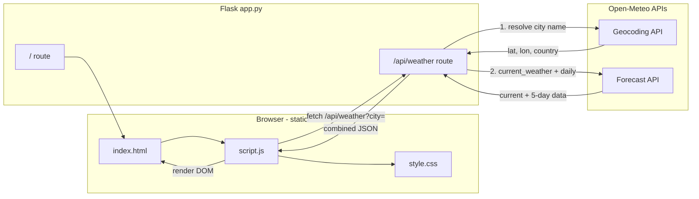
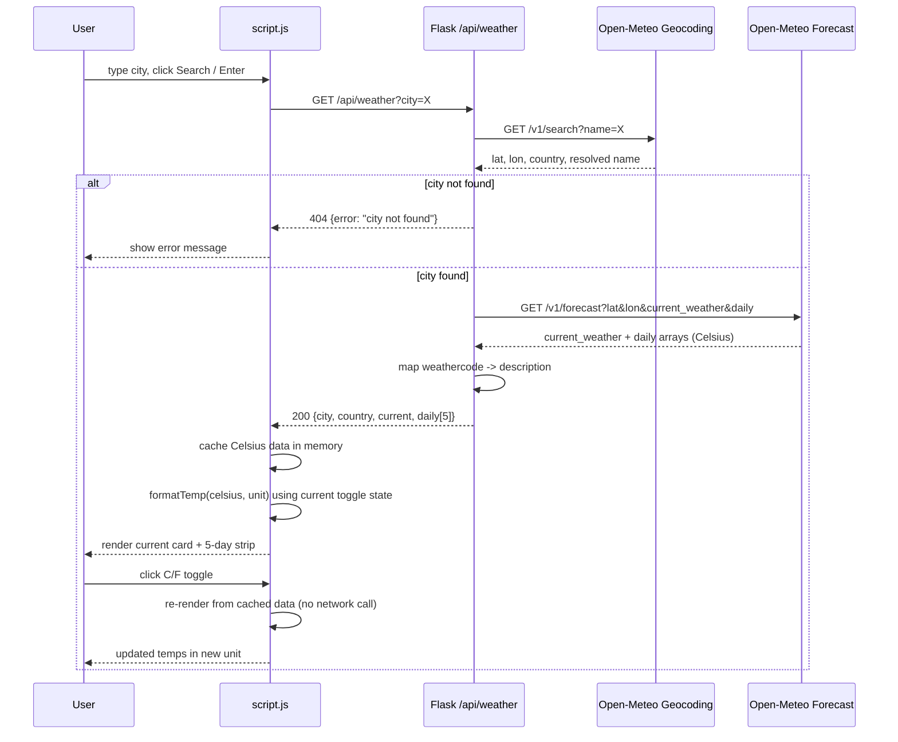

# Plan: Weather Dashboard (HTML/CSS/JS + Python/Flask, Open-Meteo)

TL;DR: Flask backend proxies Open-Meteo's free Geocoding + Forecast APIs (no API key needed) and exposes a single `/api/weather` endpoint returning current conditions + 5-day forecast. Static frontend (HTML/CSS/JS) lets user search by city, view current + 5-day forecast, and toggle °C/°F client-side (no refetch).

**Steps**

Phase 1 — Backend (Flask)
1. Create `requirements.txt` with `flask`, `requests`.
2. Create `app.py`:
   - Route `/` serves `static/index.html`.
   - Route `/api/weather?city=<name>`:
     a. Call Open-Meteo Geocoding API (`https://geocoding-api.open-meteo.com/v1/search?name={city}&count=1`) to resolve city → lat/lon/country/resolved name.
     b. If no match, return 404 JSON `{error: "city not found"}`.
     c. Call Open-Meteo Forecast API (`https://api.open-meteo.com/v1/forecast`) with `latitude`, `longitude`, `current_weather=true`, `daily=weathercode,temperature_2m_max,temperature_2m_min`, `timezone=auto`, `temperature_unit=celsius` (always fetch Celsius; frontend converts for °F).
     d. Combine into response JSON: `{city, country, current: {temp, weathercode, windspeed, time}, daily: [{date, tempMax, tempMin, weathercode}, ...] (5 entries)}`.
   - Add a small WMO weather-code → description map (server-side) attached per entry (e.g., `description` field), so frontend doesn't need its own mapping table.
   - Basic error handling: upstream timeout/non-200 → 502 JSON error.

Phase 2 — Frontend (static/) — *depends on Phase 1 response shape*
3. `static/index.html`: search input + button, current-weather card (city/country, big temp, description, wind), 5-day forecast row (5 small cards: day label, icon/description, max/min temp), °C/°F toggle switch in header.
4. `static/style.css`: card-based responsive layout, gradient background, forecast strip as flex row (wraps on small screens), toggle switch styled as pill/switch control.
5. `static/script.js`:
   - Fetch `/api/weather?city=...` on search (Enter key + button click).
   - Store last-fetched Celsius data in memory.
   - Render current + forecast from stored data using a `formatTemp(celsius, unit)` helper (`unit` = 'C' or 'F').
   - Toggle switch flips `unit` state and re-renders from cached data (no network call).
   - Handle/display errors (city not found, network failure).

Phase 3 — Verification
6. Run `pip install -r requirements.txt` then `python app.py`; open `http://127.0.0.1:5000`.
7. Manually test: valid city, invalid/misspelled city, toggle °C/°F updates both current and forecast instantly, forecast shows 5 distinct days.

**Relevant files**
- `app.py` — Flask app, `/` and `/api/weather` routes, Open-Meteo geocoding+forecast calls, WMO code map
- `requirements.txt` — `flask`, `requests`
- `static/index.html` — page structure (search, current card, forecast strip, unit toggle)
- `static/style.css` — dashboard styling
- `static/script.js` — fetch logic, render logic, client-side C/F conversion, toggle handling

**Verification**
1. `python app.py` runs without errors; `/` loads dashboard.
2. Search "London" → current weather + 5-day forecast render correctly.
3. Search nonsense city → error message shown, no crash.
4. Toggle °C/°F → values convert instantly without re-fetching network.
5. Check Flask console for no unhandled exceptions on upstream API errors (simulate by temporarily breaking URL).

**Decisions**
- Open-Meteo chosen (per user): free, no API key, so no secret-management concerns (simpler than OpenWeatherMap flow).
- Temperature unit toggle implemented client-side via cached Celsius data — avoids double network round-trip per toggle.
- 5-day forecast included; hourly forecast, geolocation, and search history explicitly excluded (not requested).
- Backend still acts as a proxy (rather than calling Open-Meteo directly from browser) to keep a consistent single-origin API and centralize error handling/mapping, even though no key is needed.

**Further Considerations**
1. Icons: use simple emoji or text description per WMO code (e.g., "☀️ Clear sky") rather than pulling external icon images, to avoid extra dependency — recommended unless you want icon graphics.

**Architecture**


**Data Flow (sequence)**


**Folder Structure**
```
cogappaugust/
├── app.py                  # Flask app: routes, Open-Meteo calls, WMO code mapping
├── requirements.txt         # flask, requests
├── static/
│   ├── index.html            # page markup (search, current card, forecast strip, toggle)
│   ├── style.css              # dashboard styling
│   └── script.js               # fetch, render, unit-toggle logic
└── .github/
    └── prompts/
        └── plan-weatherDashboard.prompt.md   # planning doc
```
- Flask's default `static_folder="static"` matches this layout, so `send_from_directory("static", "index.html")` and any `static/...` asset references work without extra config.
- Kept flat — no `templates/`, `src/`, or framework scaffolding, since this is a single Flask app + plain HTML/CSS/JS frontend with no build step.
- No `tests/` folder yet since automated tests aren't in scope (plan only calls for manual verification); can be added later for the `/api/weather` route and WMO mapping function.
